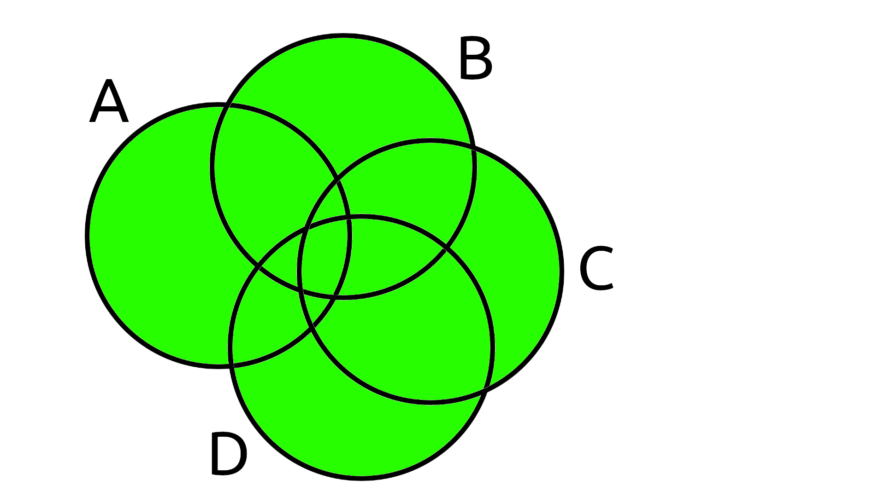
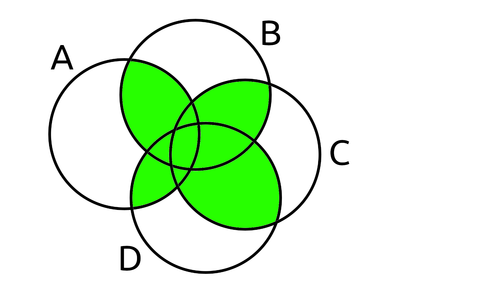
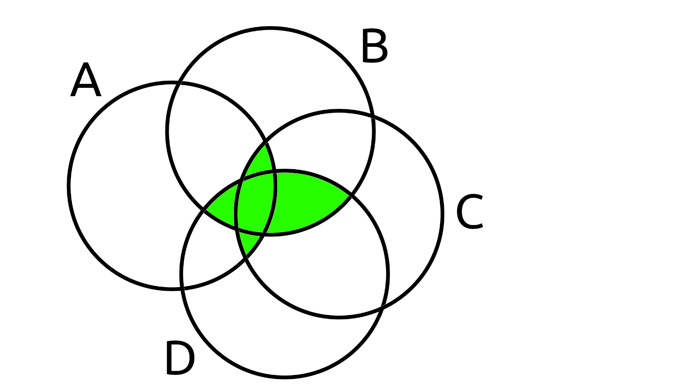
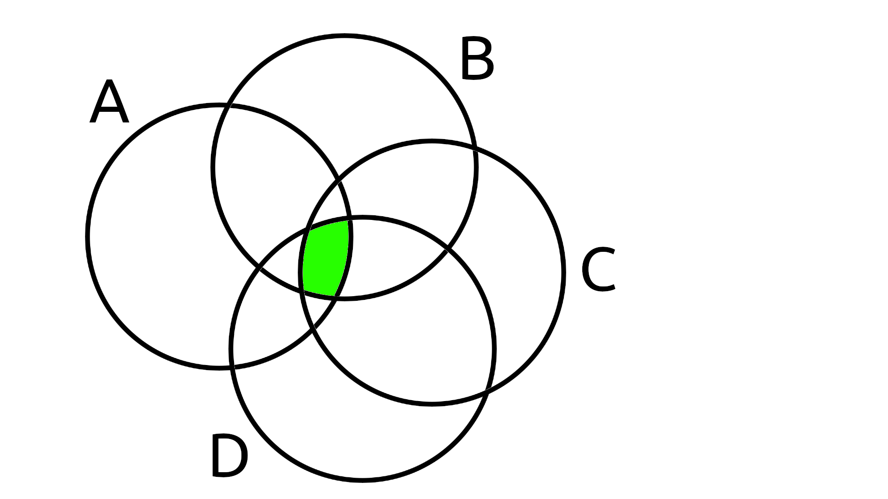
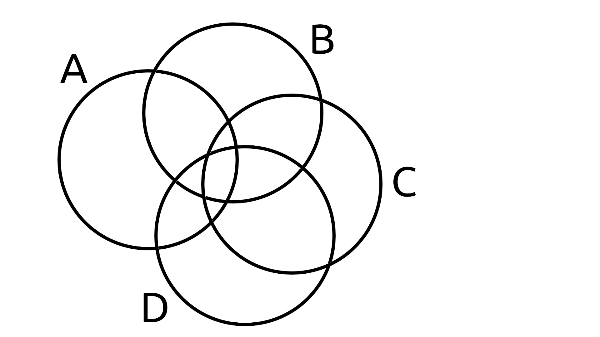

# M-partial intersection of sets and multisets explanation

[](https://scrutinizer-ci.com/g/Smoren/partial-intersection-php/?branch=master)
[](https://coveralls.io/github/Smoren/partial-intersection-php?branch=master)

[](https://opensource.org/licenses/MIT)

## Theory

### Definition

> An **M**-partial intersection (for **M > 0**) of **N** sets is a set whose elements
  are contained in at least **M** initial sets.

### Properties

For any **N** sets:

1. **1**-partial intersection is equivalent to the
   [union](https://en.wikipedia.org/wiki/Union_(set_theory)) of these sets.
2. **2**-partial intersection is equivalent to the
   [difference](https://en.wikipedia.org/wiki/Complement_(set_theory)#Relative_complement) of the
   [union](https://en.wikipedia.org/wiki/Union_(set_theory)) and the
   [symmetric difference](https://en.wikipedia.org/wiki/Symmetric_difference) of these sets.
3. **N**-partial intersection is equivalent to the
   [common (complete) intersection](https://en.wikipedia.org/wiki/Intersection_(set_theory)) of these sets.
4. For any **M > N** **M**-partial intersection always equals to the
   [empty set](https://en.wikipedia.org/wiki/Empty_set).

### Simple integer sets example

Given: sets **A**, **B**, **C**, **D** (**N = 4**).

```php
$a = [1, 2, 3, 4, 5];
$b = [1, 2, 10, 11];
$c = [1, 2, 3, 12];
$d = [1, 4, 13, 14];
```

#### M = 1
It is equivalent to `A ∪ B ∪ C ∪ D`.



```php
use Smoren\PartialIntersection\IntegerSetArrayImplementation;

$r = IntegerSetArrayImplementation::partialIntersection(1, $a, $b, $c, $d);
// [1, 2, 3, 4, 5, 10, 11, 12, 13, 14]
```

#### M = 2
It is equivalent to `(A ∪ B ∪ C ∪ D) \ (A ∆ B ∆ C ∆ D)`.



```php
use Smoren\PartialIntersection\IntegerSetArrayImplementation;

$r = IntegerSetArrayImplementation::partialIntersection(2, $a, $b, $c, $d);
// [1, 2, 3, 4]
```

#### M = 3



```php
use Smoren\PartialIntersection\IntegerSetArrayImplementation;

$r = IntegerSetArrayImplementation::partialIntersection(3, $a, $b, $c, $d);
// [1, 2]
```

#### M = 4 (M = N)
It is equivalent to `A ∩ B ∩ C ∩ D`.



```php
use Smoren\PartialIntersection\IntegerSetArrayImplementation;

$r = IntegerSetArrayImplementation::partialIntersection(4, $a, $b, $c, $d);
// [1]
```

#### M = 5 (M > N)
Equals to an empty set.



```php
use Smoren\PartialIntersection\IntegerSetArrayImplementation;

$r = IntegerSetArrayImplementation::partialIntersection(5, $a, $b, $c, $d);
// []
```

## Unit testing
```
composer install
composer test-init
composer test
```
